### InternStudio开发机创建与环境搭建

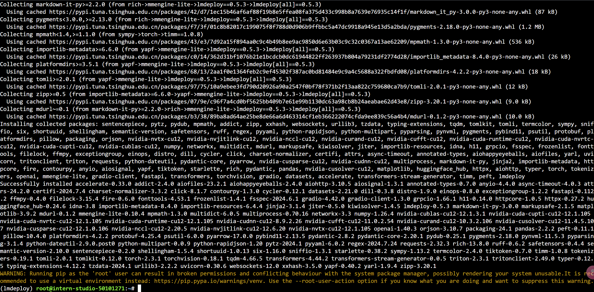

### InternStudio环境获取模型

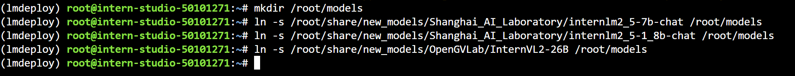

### LMDeploy验证启动模型文件

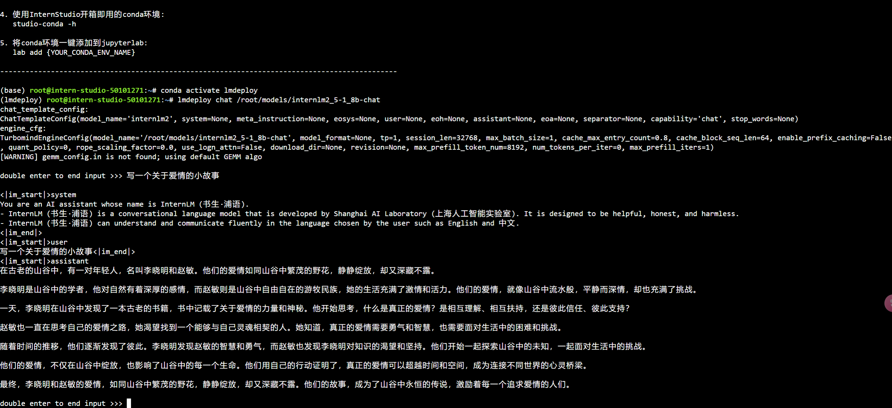

此时的现存为：

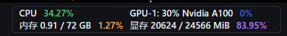

### 2.1 LMDeploy API部署InternLM2.5

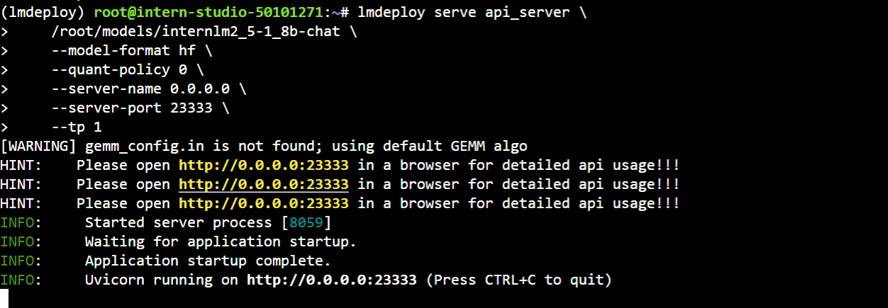

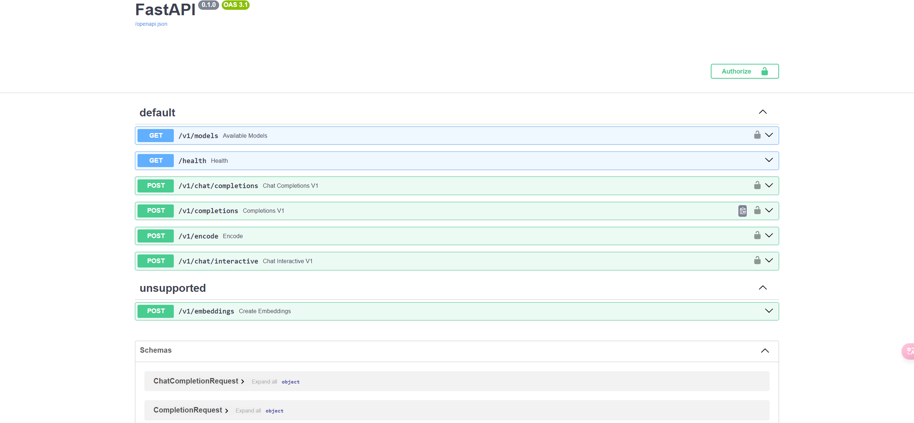

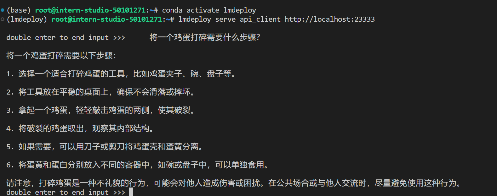

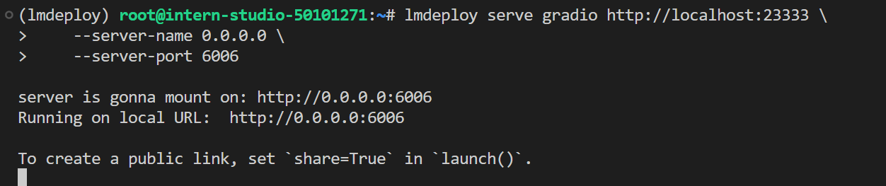

#### 以Gradio网页形式连接API服务器

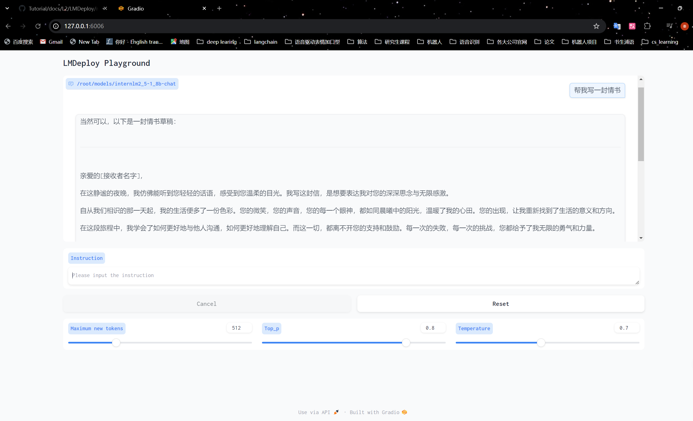

### **设置最大kv cache缓存大小**

###  设置**在线** kv cache int4/int8 量化

### 2.2.3 W4A16 模型量化和部署

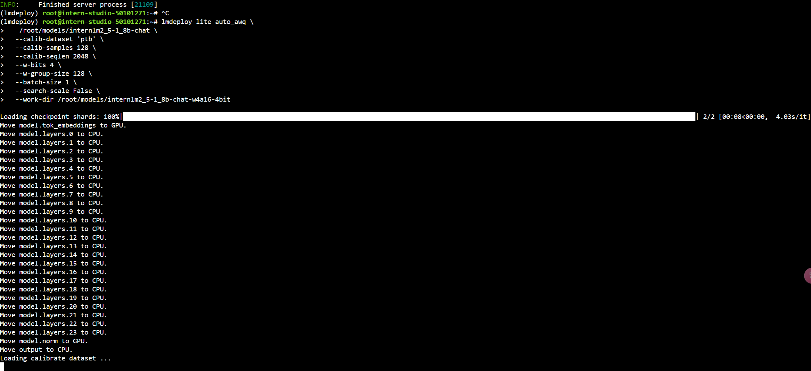

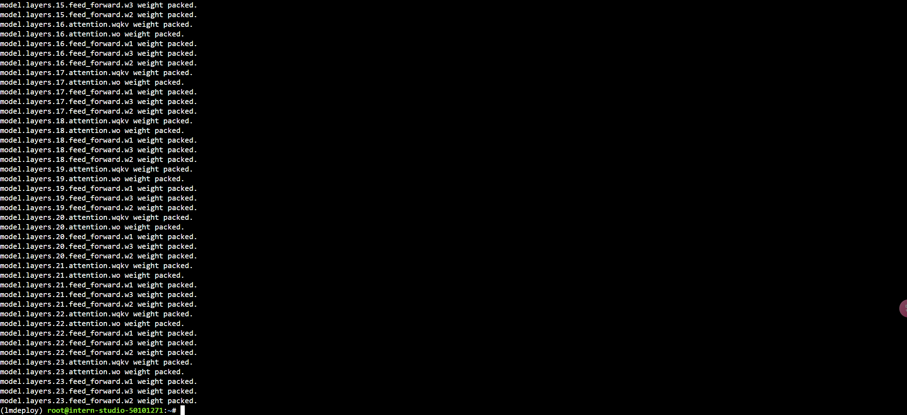

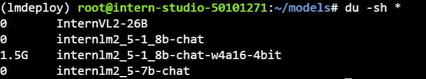

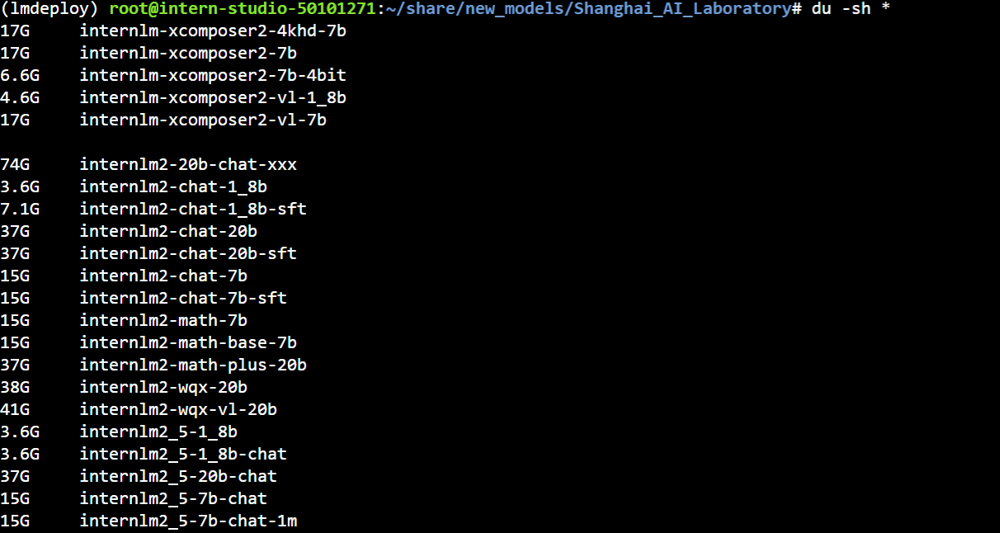

### 2.2.4 W4A16 量化+ KV cache+KV cache 量化并模型封装本地API并与大模型进行一次对话

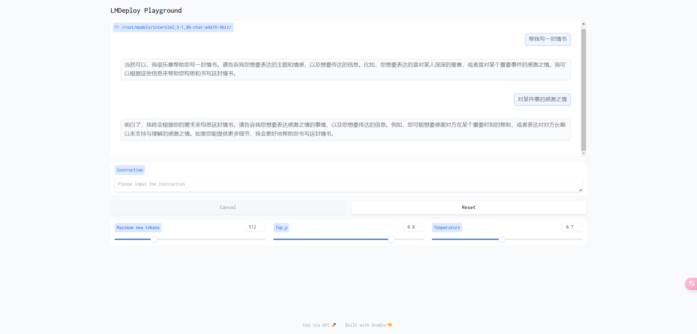

### 此时的显存占用情况

