### 按照文档要求进行环境配置以及文件夹创建

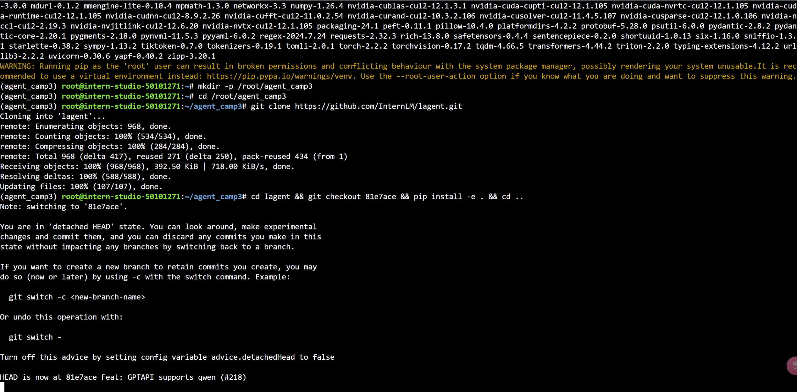

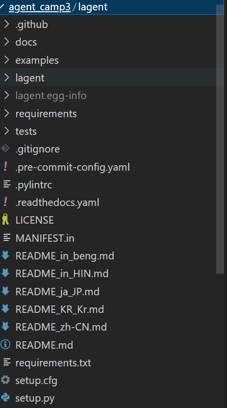

### 使用 LMDeploy 部署 InternLM2.5-7B-Chat，并启动一个 API Server。

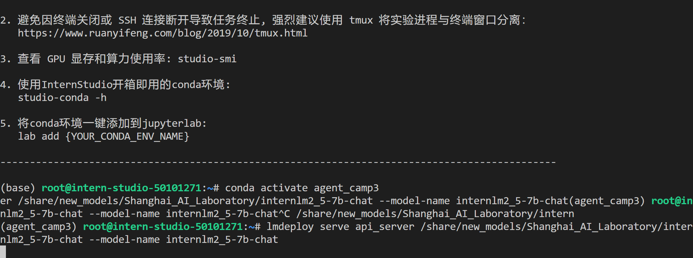

### 在另一个窗口中启动 Lagent 的 Web Demo

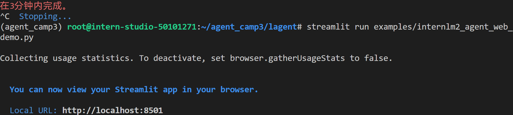

### 在 **本地** 的 PowerShell 中输入如下指令来进行端口映射

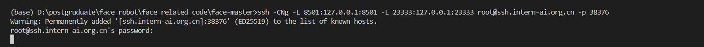

### 选择模型与ip，回答相关问题

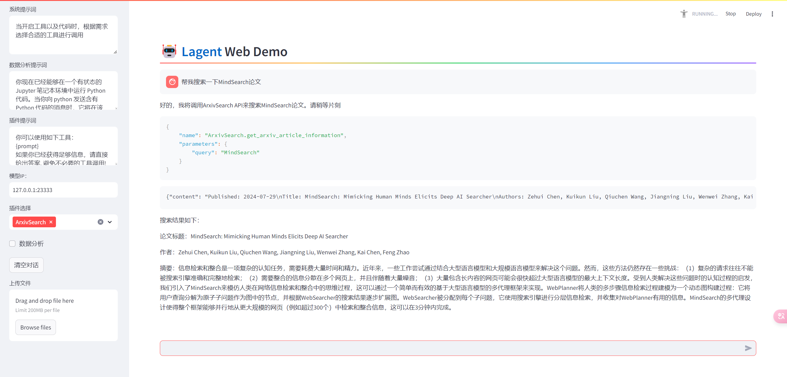

### 创建python文件，并且更改相应的文件内容

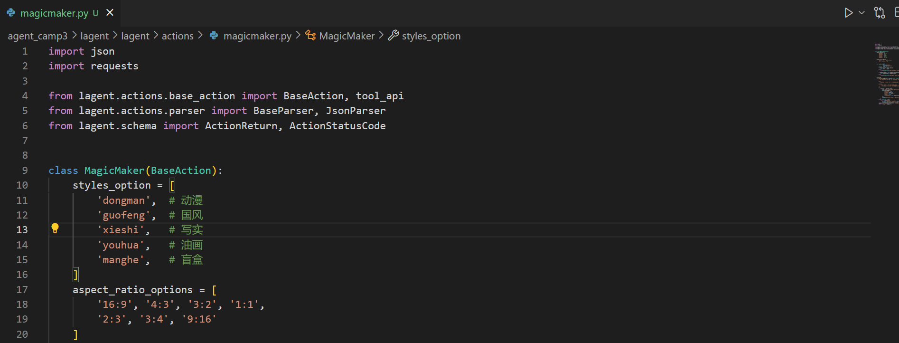

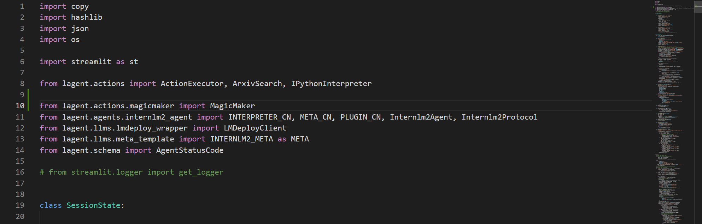

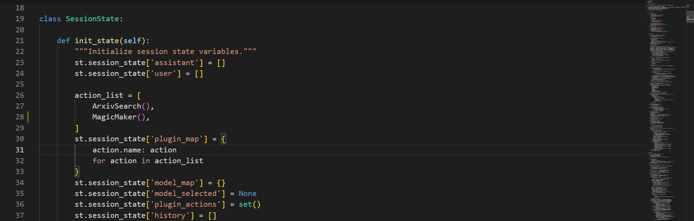

### 使用web demo体验自定义lagent

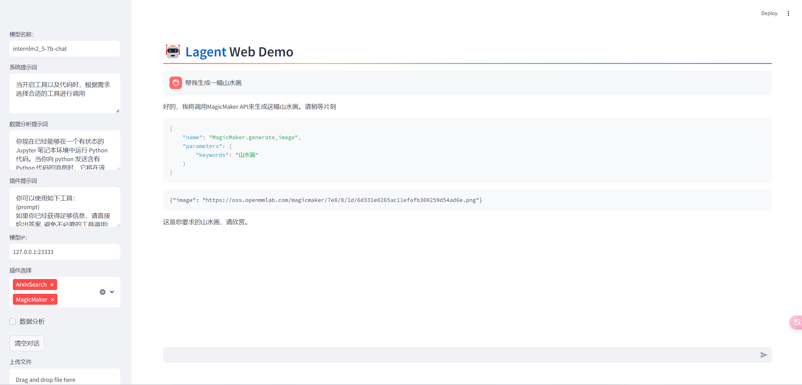

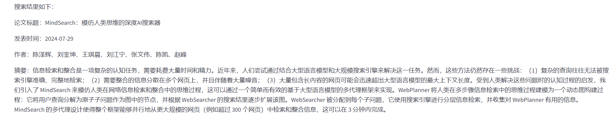

